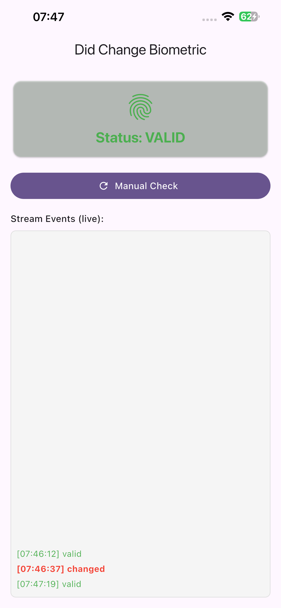
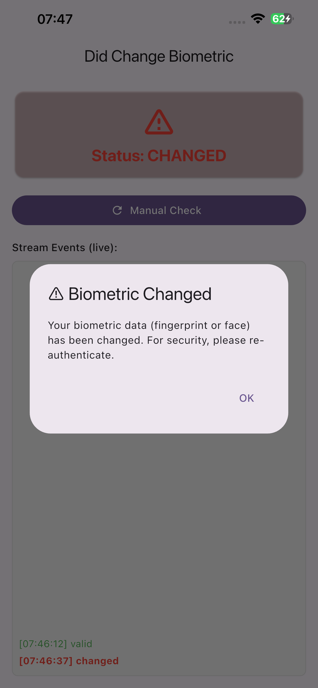

# did_change_authlocal

A Flutter plugin that detects when biometric data (Face ID, Touch ID, Fingerprint, Face Recognition) has been changed on the device. Protects against unauthorized biometric enrollment.

## Why?

Imagine someone secretly adds their face or fingerprint to your device while it's unlocked. They can then unlock your app without your permission and access everything. This plugin detects exactly that — any biometric enrollment change since the last check.

## Features

- ✅ **Real-time monitoring stream** — Detects biometric changes as they happen (via native `EventChannel`)
- ✅ **iOS**: Detects Face ID and Touch ID changes via `LAContext` + `NotificationCenter` lifecycle
- ✅ **Android**: Detects Fingerprint AND Face Recognition changes via KeyStore + Coroutines Flow
- ✅ **Persistent change detection**: Change state persists until explicitly acknowledged
- ✅ **Platform-agnostic Dart**: Both platforms emit through the same EventChannel
- ✅ **Swift Package Manager support** (ready for Flutter 3.44+)
- ✅ **Dart 3 / Flutter 3.10+** with sound null safety

## Getting Started

```yaml
dependencies:
  did_change_authlocal: ^1.0.0
```

## Usage

### ⭐ Stream API (Recommended)

Real-time monitoring — automatically detects changes when user returns from Settings:

```dart
import 'dart:async';
import 'package:did_change_authlocal/did_change_authlocal.dart';

class _MyAppState extends State<MyApp> {
  late StreamSubscription<AuthLocalStatus> _subscription;

  @override
  void initState() {
    super.initState();
    _subscription = DidChangeAuthLocal.instance.onBiometricChanged.listen(
      (status) {
        switch (status) {
          case AuthLocalStatus.valid:
            // All good — no biometric change
            break;
          case AuthLocalStatus.changed:
            // ⚠️ Biometric changed! Handle it.
            _handleBiometricChange();
            break;
          case AuthLocalStatus.invalid:
            // No biometric available
            break;
        }
      },
    );
  }

  @override
  void dispose() {
    _subscription.cancel(); // Stops native monitoring
    super.dispose();
  }

  Future<void> _handleBiometricChange() async {
    await clearStoredCredentials();
    await DidChangeAuthLocal.instance.acknowledgeChange();
  }
}
```

### One-shot API (Legacy)

Manual check with token comparison:

```dart
// Get and save token on first launch
final token = await DidChangeAuthLocal.instance.getTokenBiometric();
await saveToken(token); // Your storage logic

// Check on subsequent launches
final status = await DidChangeAuthLocal.instance.onCheckBiometric(
  token: savedToken, // Required for iOS, ignored on Android
);

if (status == AuthLocalStatus.changed) {
  await clearStoredCredentials();
  await DidChangeAuthLocal.instance.acknowledgeChange();
}
```

## API Reference

| Method | Description |
|--------|-------------|
| `onBiometricChanged` ⭐ | Stream that emits `AuthLocalStatus` on biometric changes |
| `onCheckBiometric({String? token})` | One-shot check. Pass saved token for iOS. |
| `getTokenBiometric()` | Get current biometric token (save for comparison). |
| `acknowledgeChange()` | Acknowledge a change. Resets detection state. |

## Architecture

Both platforms use **native** monitoring — no Dart-side polling or lifecycle hacks:

| | Android | iOS |
|---|---------|-----|
| **Detection** | KeyStore key invalidation | `evaluatedPolicyDomainState` token |
| **Stream** | Kotlin Coroutines `StateFlow` | `FlutterStreamHandler` |
| **Lifecycle** | `DefaultLifecycleObserver.onResume` | `NotificationCenter.willEnterForeground` |
| **Fallback** | Periodic polling (5s) | Not needed (instant token check) |
| **Filtering** | `distinctUntilChanged` via Flow | Native `emitIfChanged` |
| **Biometrics** | Fingerprint + Face | Touch ID + Face ID |

## Screenshots

<table style="border: none;">
  <tr>
    <td align="center"></td>
    <td align="center"></td>
  </tr>
</table>

## Demo


